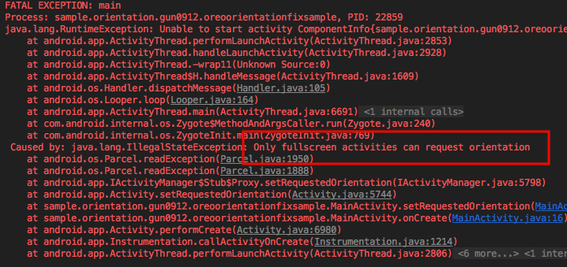

# Oreo 단말에서 투명액티비티

Oreo (8.0, sdk 26) 단말에서 투명액티비티를 화면고정하여 출력 시 죽는 문제가 발생한다.

`"Only fullscreen opaque activities can request orientation"`



위의 에러는 투명 액티비티를 화면고정할 경우 발생한다.

## 이 오류는 왜 발생하는가

여러가지 이유로 투명한 Activity를 만들기위해서 style.xml에 `android:windowIsTranslucent`를 사용합니다.

```
<style name="AppTheme.Transparent" parent="@style/TransparentBase">
	<item name="android:windowIsTranslucent">true</item>
</style>
```

문제는 이 android:windowIsTranslucent로 인해서 발생합니다.

API 26(8.0) SDK에서 아래와 같은 코드가 추가되었습니다.


https://android.googlesource.com/platform/frameworks/base/+/android-8.0.0_r36/core/java/android/app/Activity.java#986

API26에서는 Translucent/Floating 으로 만든 투명한 Activity들은 화면 회전고정을 하지 못하게 의도한 것입니다.

아래 commit 메세지에서 위와같은 코드를 추가한 것입니다.

https://android.googlesource.com/platform/frameworks/base/+/39791594560b2326625b663ed6796882900c220f

**API 27(8.1)기기 이후부터는 `windowIsTranslucent`을 사용해도 오류를 발생시키지 않게 됩니다.**

**즉, 이 오류 메세지는 API 26(8.0) 기기에서만 발생합니다.**

위의 문제를 해결하는 방법은

1. 화면고정을 푼다.
2. 액티비티를 투명으로 하지 않는다.
3. Sdk 26 에서만 windowsTranslucent 안쓰기

### 화면 고정 풀기

```
<activity android:name=".MainActivity"
    android:screenOrientation="portrait"
    android:theme="@style/AppTheme.Transparent">
```


위의 코드를


``` android:screenOrientation="unspecified" ```

### 액티비티 투명 없애기

```
<item name="android:windowBackground">@android:color/transparent</item>
<item name="android:windowIsTranslucent">true</item>
```

위의 코드를


```
<item name="android:windowBackground">@android:color/white</item>
```


등으로 바꾼다.

### Sdk 26 에서만 windowsTranslucent 안쓰기

values/style.xml
```
<style name="TransparentBase" parent="@style/AppTheme">
	<item name="android:windowBackground">@android:color/transparent</item>
</style>

<style name="AppTheme.Transparent" parent="@style/TransparentBase">
	<item name="android:windowIsTranslucent">true</item>
</style>
```


values-v26/style.xml
```
<style name="AppTheme.Transparent" parent="@style/TransparentBase" />
```

values-v27/style.xml
```
<style name="AppTheme.Transparent" parent="@style/TransparentBase">
    <item name="android:windowIsTranslucent">true</item>
</style>
```
